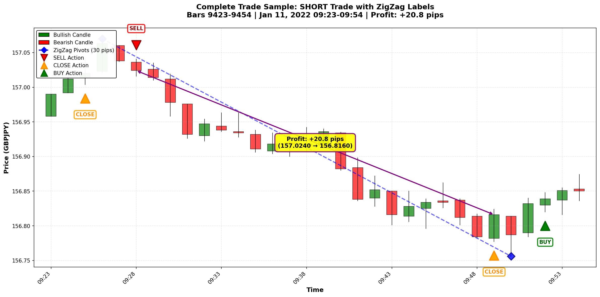
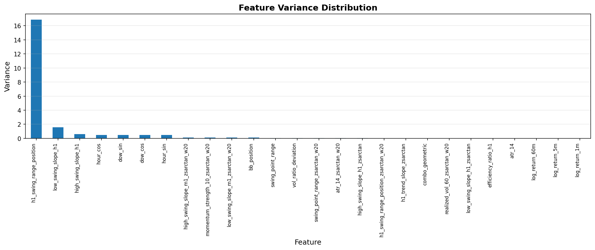
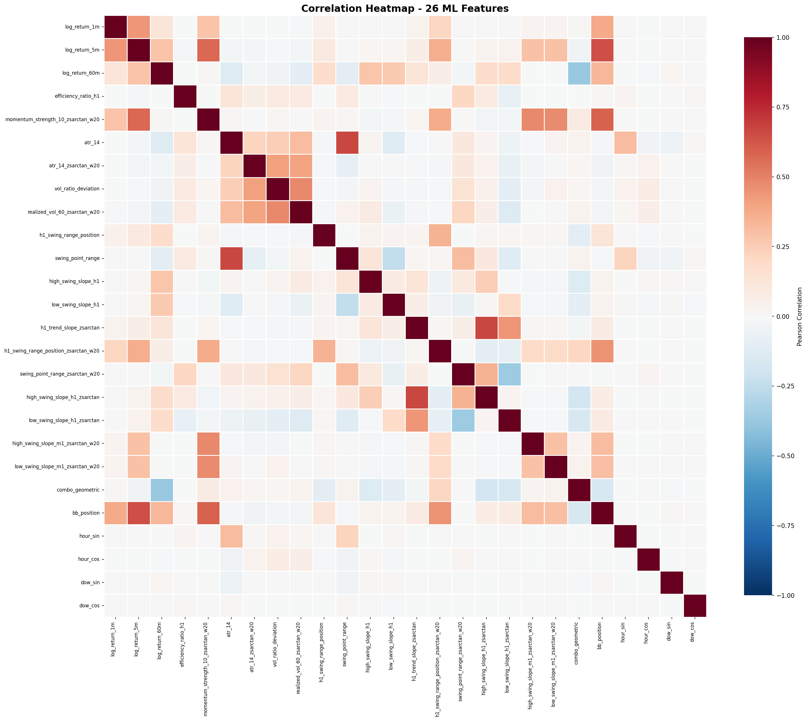

# PPO M1 Trading System – 4-Action GBPJPY

Proximal Policy Optimization for GBPJPY trading with **M1 data**, **6-hour sessions**, **4-action space**, and **AMDDP1 reward** (1% DD penalty).

## ⚠️ Current Status: Training Blocked

**Issue**: DummyVecEnv (sequential) too slow for PPO learning. After ~2.35M timesteps (20K trades, 5 hours):
- Expectancy: -0.066R (-0.79 pips/trade) - no improvement
- Win rate: 7.3% (random baseline ~50%)
- SubprocVecEnv (parallel) required but DuckDB connections fail pickling

**Next Steps**: Implement thread-local DuckDB connections or connection pooling for SubprocVecEnv compatibility.

---

## 🎯 Action Space (4 discrete actions)

* **0 = HOLD** → Do nothing, maintain current state
* **1 = BUY** → Open long position (only if flat)
* **2 = SELL** → Open short position (only if flat)
* **3 = CLOSE** → Exit position (only if in trade)

**Action Logic:**
- No action masking - invalid actions (BUY when long, CLOSE when flat) are ignored
- Agent must explicitly choose CLOSE - no auto-closing
- No reversals - must close before opening opposite direction

---

## 🏗️ Neural Network Architecture

**Stable-Baselines3 MlpPolicy:**
* **Input**: 32 features (26 market ML + 6 position state)
* **Network**: [64, 128, 32] with ReLU activation
* **Output**: 4 action logits (HOLD, BUY, SELL, CLOSE)
* **Total parameters**: ~20K

**26 Market ML Features from master.duckdb:**
1. `log_return_1m`, `log_return_5m`, `log_return_60m` - Multi-timeframe momentum
2. `efficiency_ratio_h1` - H1 trending strength
3. `momentum_strength_10_zsarctan_w20` - 10-bar momentum z-score
4. `atr_14`, `atr_14_zsarctan_w20` - Volatility measures
5. `vol_ratio_deviation`, `realized_vol_60_zsarctan_w20` - Volatility regime
6. H1 swing features: `h1_swing_range_position`, `swing_point_range`, slopes
7. M1 swing slopes with z-scores
8. `combo_geometric` - Feature interaction
9. `bb_position` - Bollinger Band position
10. `hour_sin/cos`, `dow_sin/cos` - Cyclical time features

**6 Position State Features:**
- Current position (-1/0/1)
- PnL (pips, scaled, ATR-normalized)
- Time in position
- Accumulated drawdown
- Peak pips

---

## ⚙️ PPO Configuration

```python
PPO_CONFIG = {
    "learning_rate": 3e-4,
    "n_steps": 2048,
    "batch_size": 64,
    "n_epochs": 10,
    "gamma": 0.99,
    "gae_lambda": 0.95,
    "clip_range": 0.2,
    "ent_coef": 0.01,
    "vf_coef": 0.5,
    "max_grad_norm": 0.5,
}

TRAINING = {
    "total_timesteps": 1_000_000,
    "episode_length": 360,  # 360 M1 bars = 6 hours
    "n_envs": 4,  # Currently DummyVecEnv (sequential)
    "initial_balance": 10000.0,
    "reward_scaling": 0.01,
}
```

---

## 🎯 Reward Function (AMDDP1)

```python
# Phase 1 (optional): Winner-only learning (first 1000 profitable trades)
if enable_phase1 and profitable_count < 1000:
    reward = last_trade_pips * 0.01 if trade_won else 0.0

# Phase 2 (default): Full AMDDP1 with 1% DD penalty
else:
    reward = pnl_change - 0.01 * accumulated_dd
    if trade_won:
        reward += 0.5  # Bonus for closing winners
```

**Key Parameters:**
- **DD Penalty**: 1% of accumulated drawdown (correct AMDDP1)
- **Winner Bonus**: +0.5 for closing profitable trades
- **Phase1**: Optional `--phase1_1000winners` flag

---

## 🚀 Quick Start (Docker Compose)

### 1. Start training + monitoring
```bash
docker compose up -d --build ppo-training ppo-monitor
```

### 2. Watch live expectancy
```bash
docker compose logs -f ppo-monitor
```

### 3. Check training logs
```bash
docker compose logs -f ppo-training
```

### 4. Stop training
```bash
docker compose stop ppo-training ppo-monitor
```

---

## 📊 Data Pipeline

**Source**: `master.duckdb` (1.33M M1 bars, 379MB)
- **Timeframe**: M1 (1-minute bars)
- **Features**: 67 precomputed columns (26 used for ML)
- **Episodes**: 360 M1 bars = 6 hours per episode
- **No aggregation**: Uses M1 data directly (not M5)

**Note**: `precompute_features_to_db.py` is DEPRECATED - it incorrectly aggregates M1→M5

---

## 📊 Monitoring & Logging

**Live Expectancy Monitor** (`ppo-monitor` container):
- Reads `results/rolling_expectancy.json` every 5 seconds
- Shows rolling 100/500/1000-trade windows
- Displays expectancy (R-multiples), win rate, cumulative P&L

**Training Logs**:
- Trade execution logged every 100 trades
- Format: `✅/❌ Trade #N: X.X pips | Profitable: N/M | Phase: 2-All`

**Files Written**:
- `results/rolling_expectancy.json` - Live expectancy stats (updated every 10 trades)
- `tensorboard/` - PPO training metrics
- `models/` - Checkpoint saves every 10K steps

---

## 📈 Latest Training Results (Oct 6, 2025)

**Run Duration**: 5 hours (~2.35M timesteps, 20K trades)

**Performance**:
- **Expectancy**: -0.066R (-0.79 pips/trade) 🔴
- **Win Rate**: 7.3% (random baseline ~50%) 🔴
- **Status**: No learning detected

**Issue**: DummyVecEnv (sequential) too slow for PPO to learn effectively. SubprocVecEnv (parallel) required but DuckDB connections fail pickling.

**Next Steps**: Implement thread-local DuckDB connections or connection pooling

---

## 📁 Project Structure

```
picco-ppo/
├── env/
│   └── trading_env_4action.py     # 4-action environment with masking
├── config_improved.py              # Configuration settings
├── train_improved.py               # Training script (now uses 4-action)
├── validate_improved.py            # Validation and metrics
├── trade_live_improved.py          # Live trading with risk controls
├── monitor_continuous.py           # Python monitoring
├── monitor_training_live.sh        # Bash monitoring
├── checkpoints/                    # Saved models
├── master.duckdb                   # M1 OHLCV + swing features (1.3M bars)
├── generate_all_features.py        # Master feature generation script
├── add_swing_points.py             # Swing detection (M1 and H1)
├── add_swing_range_position.py     # H1 range position calculation
├── add_arctan_zscore_features.py   # Z-score features with fixed std
├── analyze_extreme_events.py       # Extreme event profitability analysis
├── feature_zscore_config.json      # Fixed std configuration
└── db-state.txt                    # Complete database documentation
```

---

## 📊 Feature Engineering & Analysis

### Master Database (master.duckdb)

1.3M M1 bars (GBPJPY, 2022-2025) with comprehensive swing-based features:

#### Swing Detection
- **M1 swings**: 274,699 highs, 274,264 lows (20.6% of bars)
- **H1 swings**: 22,394 highs, 22,394 lows (1.7% of bars)
- Pattern: `h[i] > h[i-1] AND h[i] > h[i+1]`

#### Position Features
- **h1_swing_range_position**: Price location within H1 range [0, 1]
- **swing_point_range**: H1 range magnitude (consolidation detector)

#### Swing Slope Features
- **high_swing_slope_h1**: Rate of change between consecutive H1 swing highs (pips/bar)
  - Mean: -0.012 pips/bar, Range: [-11.68, +63.00]
  - Forward-filled from each swing high until next
- **low_swing_slope_h1**: Rate of change between consecutive H1 swing lows (pips/bar)
  - Mean: +0.019 pips/bar, Range: [-91.50, +23.93]
  - Forward-filled from each swing low until next

#### Z-Score Features (Window=20, Fixed Std)
- **h1_swing_range_position_zsarctan_w20**:
  - Detects extreme price positions within H1 range
  - Fixed std=3.421357 (923K training rows)
  - Extremes (|z|>0.8): 3,228 events (0.25%)
- **swing_point_range_zsarctan**:
  - Detects when H1 range itself is extreme (tight/wide)
  - Fixed std=0.221478 (933K training rows)
  - Extremes (|z|>0.8): 3,237 events (0.24%)
- **high_swing_slope_h1_zsarctan**:
  - Detects extreme uptrends/downtrends in swing highs
  - Fixed std=0.619729 (933K training rows)
  - Extremes (|z|>0.8): 3,782 events (0.28%)
- **low_swing_slope_h1_zsarctan**:
  - Detects extreme uptrends/downtrends in swing lows
  - Fixed std=1.341183 (933K training rows)
  - Extremes (|z|>0.8): 1,053 events (0.08%)
- **combo_geometric** (Interaction Feature):
  - Formula: `sign(r×p) × sqrt(|range_z| × |position_z|)`
  - Geometric mean: penalizes imbalance (small×big < medium×medium)
  - **69% better** than arithmetic multiply (0.077 vs 0.046 avg correlation)
  - Strong signals (|z|>0.5): 7,828 events (0.60%)
  - Quadrant-specific predictive power:
    - Q2 (big range, centered): **+0.184** correlation (strongest!)
    - Q1 (both big): +0.104 correlation
    - Q3 (consolidation extreme): -0.062 (reversal signal)

### Extreme Event Analysis Results

**Key Findings** (from analyze_extreme_events.py):

| Metric | Window=20 | Window=500 |
|--------|-----------|------------|
| Events/day | 3.5 | 7.6 |
| Continuation rate | 62.6% | 55.8% |
| Mean 30-min return | +5.70 pips | +1.29 pips |
| Pullback rate | 70% | 76% |

**Entry Strategy**:
- Immediate entry (0% retracement): +4.08 pips mean
- Wait for 22% retracement: +1.40 pips mean (misses 43% of trades)
- **Conclusion**: Immediate entry optimal; S5/tick data NOT recommended

**Feature Value for PPO**:
- Weak standalone edge (5.8% over random)
- Break-even after 4 pip spread
- BUT: Captures real regime information
- PPO can learn optimal timing within 30-min window
- **Recommendation**: Include as supporting feature, combine with reactive/lessreactive

### Feature Generation

**Master script**: `generate_all_features.py`

Regenerates all features in correct dependency order:
1. Swing point detection (M1 and H1)
2. Last swing tracking (indices + prices)
3. H1 swing range position
4. Swing point range
5. H1 swing slopes (high and low)
6. Z-score features with Window=20
7. combo_geometric interaction feature

Runtime: ~7.5 minutes for 1.3M bars

**Interaction Feature Development**:
- Tested 7 combination methods (multiply, ratio, weighted, conditional, etc.)
- Geometric mean emerged as **best predictor** (69% improvement)
- Differentiates market regimes: wide range vs consolidation breakouts
- Test script: `test_feature_combinations.py`

---

## 🔬 Technical Details

### Feature Space (32 dimensions)
- **Market features** (26): ML-ready features from database (momentum, volatility, swing, z-scores, indicators, time)
- **Position features** (6): Position state, unrealized P&L, time in position, drawdown metrics

See `db-state.txt` for complete feature formulas and `sample_features.csv` for data examples.

### Action Masking Implementation
Action masking prevents invalid actions (CLOSE when flat, BUY/SELL when in position):
- Implemented in `PolicyNetwork.get_action()` by setting invalid logits to -1e8
- Position state tracked via `position_side` feature (index 26)

---

## 📊 Feature Analysis & Visualizations

### Complete Trade Sample

*32-bar SHORT trade example showing ZigZag pivots, entry/exit points, and +20.8 pip profit*

### Feature Variance Distribution

*Variance analysis showing temporal features dominate variance (hour/dow cyclical patterns)*

### Correlation Analysis

*Feature correlation matrix - optimized to zero high-correlation pairs (|r| > 0.7)*

**Analysis Results:**
- **26 ML features** normalized to [-1, 1] range
- **Zero high-correlation pairs** (|r| > 0.7) after removing 3 redundant features
- **Variance dominated** by temporal features (hour/dow cycles)
- Run `python analyze_features_correlation.py` to regenerate analysis

---

This setup balances **learning efficiency** (with action masking and residual connections) and **practical trading control**, using an optimized **32→64→128→32 architecture** with ~18K parameters for stability and speed.